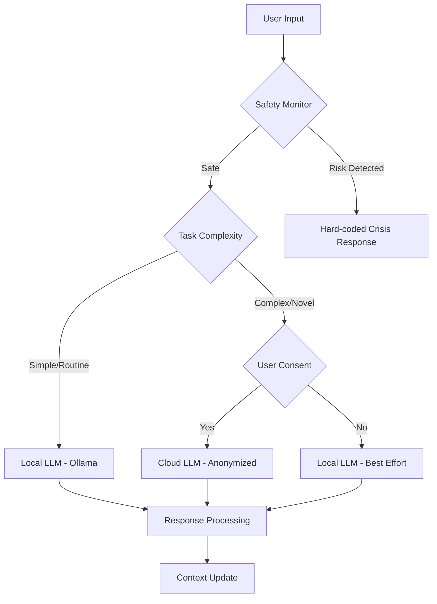
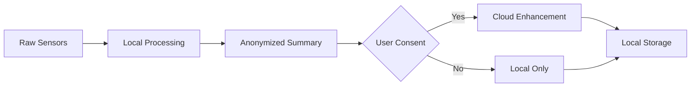

# MCP ADHD Server - Technology Stack Analysis

> **Optimizing for Privacy, Performance, and Neurodiversity-Affirming Design**

## 🎯 **Stack Selection Criteria**

Based on your research documents and ADHD-specific requirements:

1. **Privacy-First**: On-device processing where possible, minimal data transmission
2. **Low Latency**: ADHD brains need immediate feedback, not 3-5 second delays
3. **Offline Capability**: System must work during internet outages
4. **Resource Efficiency**: Should run on modest hardware
5. **Clinical Safety**: Deterministic safety overrides, not probabilistic LLM responses
6. **Cost Efficiency**: Sustainable for individual users ($29-99/month target)

## 🧠 **LLM Strategy: Hybrid Local + Cloud**

### **Recommended Architecture**



### **Local LLM Selection - Ollama**

**Primary Recommendation: DeepSeek-R1:1.5B**
- **Size**: 1.5B parameters (~3GB RAM)
- **Performance**: Excellent reasoning for size
- **Speed**: ~50-100 tokens/second on CPU
- **Use Cases**: Daily nudges, routine responses, basic scaffolding

**Fallback Option: Gemma 2:2B**
- **Size**: 2B parameters (~4GB RAM)  
- **Performance**: Google-trained, instruction-tuned
- **Speed**: ~40-80 tokens/second on CPU
- **Use Cases**: More complex reasoning when needed

**Why Not Llama 3.2:1B?**
- DeepSeek-R1 shows better reasoning capabilities
- Gemma has better safety training
- Both have more permissive licenses for commercial use

### **Cloud LLM Strategy**

**Primary: Anthropic Claude 3.5 Sonnet**
- **Reasoning**: Better therapeutic tone, safety-focused training
- **Privacy**: Anthropic's no-training policy on API data
- **Context**: 200K tokens for long-term memory integration
- **Cost**: ~$3-15/user/month for complex queries

**Fallback: OpenAI GPT-4o-mini**
- **Reasoning**: Cost-effective, fast inference
- **Use Case**: When Claude unavailable or rate-limited
- **Cost**: ~$1-5/user/month

## 🏗️ **Revised Technology Stack**

### **Core Runtime**
```yaml
Language: Python 3.11+
Web Framework: FastAPI
ASGI Server: Uvicorn
Process Manager: Gunicorn (production)
```

### **Local AI/ML**
```yaml
LLM Runtime: Ollama
Primary Model: deepseek-r1:1.5b
Fallback Model: gemma2:2b
Safety Classifier: distilbert-base-uncased (fine-tuned)
Embedding Model: all-MiniLM-L6-v2 (384 dimensions)
```

### **Storage Architecture**
```yaml
Hot Memory: Redis 7+ (context, active sessions)
Cold Storage: SQLite (local) + PostgreSQL (optional cloud sync)
Vector Storage: ChromaDB (embedded) or Qdrant (local)
File Storage: Local filesystem with optional S3 sync
```

### **Communication & Integration**
```yaml
Message Queue: Redis Pub/Sub
Home Assistant: REST API + WebSocket
Telegram: python-telegram-bot
Calendar: caldav (local) + Google Calendar API (optional)
Notifications: Local system notifications + external APIs
```

### **Monitoring & Observability**
```yaml
Telemetry: OpenTelemetry (local export)
Logging: structlog + local file rotation
Metrics: Prometheus (embedded) or simple JSON export
Health Checks: Built-in endpoint monitoring
```

### **Development & Deployment**
```yaml
Package Manager: Poetry
Testing: pytest + pytest-asyncio
Code Quality: ruff + mypy
Containerization: Docker + docker-compose
Orchestration: Docker Swarm (simple) or K3s (advanced)
```

## 🔍 **Detailed Component Analysis**

### **Local LLM Performance Comparison**

| Model | Size | RAM Usage | CPU Speed | Quality | Use Case |
|-------|------|-----------|-----------|---------|----------|
| DeepSeek-R1:1.5B | 3GB | 4-6GB | 50-100 tps | High reasoning | Primary local |
| Gemma 2:2B | 4GB | 5-7GB | 40-80 tps | Balanced | Fallback local |
| Llama 3.2:3B | 6GB | 7-9GB | 30-60 tps | Good general | Too resource heavy |
| Qwen2.5:1.5B | 3GB | 4-6GB | 45-90 tps | Good multilingual | Alternative |

### **Storage Strategy Deep Dive**

**Hot Memory (Redis)**
```python
# Configuration for ADHD-optimized caching
REDIS_CONFIG = {
    "maxmemory": "2gb",
    "maxmemory_policy": "allkeys-lru",
    "save": ["900", "1", "300", "10"],  # Persistence for safety
    "appendonly": "yes",  # Additional durability
}
```

**Local Vector Database (ChromaDB)**
```python
# Embedded vector storage for pattern matching
CHROMA_CONFIG = {
    "persist_directory": "./data/vector_db",
    "embedding_function": "all-MiniLM-L6-v2",  # 384 dims, fast
    "collection_metadata": {"hnsw:space": "cosine"},
}
```

**SQLite for Local Persistence**
```python
# ADHD-specific schema optimizations
SQLITE_CONFIG = {
    "database": "./data/mcp_adhd.db",
    "wal_mode": True,  # Better concurrency
    "sync_mode": "NORMAL",  # Balance safety/performance
    "cache_size": 64000,  # 64MB cache
}
```

## ⚡ **Performance Optimizations**

### **ADHD-Specific Latency Requirements**

| Interaction Type | Target Latency | Implementation |
|------------------|----------------|----------------|
| Crisis Detection | <100ms | Hard-coded rules, no LLM |
| Simple Nudge | <500ms | Local LLM, cached templates |
| Complex Response | <2s | Local LLM with context |
| Environmental Action | <1s | Direct API calls |
| Pattern Analysis | <5s | Background processing |

### **Local LLM Optimization**

```python
# Ollama configuration for ADHD responsiveness
OLLAMA_CONFIG = {
    "model": "deepseek-r1:1.5b",
    "options": {
        "temperature": 0.7,
        "top_p": 0.9,
        "max_tokens": 150,  # Short responses for ADHD
        "stop": ["Human:", "User:", "\n\n"],
        "num_ctx": 2048,  # Sufficient context
        "num_predict": 150,  # Limit output length
    }
}
```

### **Memory Management for ADHD Patterns**

```python
# Cognitive load-aware caching strategy
class ADHDMemoryManager:
    def __init__(self):
        self.hot_patterns = LRUCache(maxsize=1000)  # Recent patterns
        self.user_context = TTLCache(maxsize=100, ttl=3600)  # 1 hour TTL
        self.environment_state = TTLCache(maxsize=50, ttl=300)  # 5 min TTL
    
    def get_context_for_nudge(self, user_id: str) -> Dict[str, Any]:
        # Optimized context retrieval for fast nudge generation
        return {
            "recent_patterns": self.hot_patterns.get(user_id, []),
            "current_state": self.user_context.get(user_id, {}),
            "environment": self.environment_state.get(user_id, {})
        }
```

## 🔒 **Privacy & Security Architecture**

### **Data Flow Strategy**



### **Security Implementation**

```python
# Privacy-preserving data handling
class PrivacyManager:
    def __init__(self):
        self.local_key = self._generate_device_key()
        self.anonymizer = DataAnonymizer()
    
    def process_sensitive_data(self, data: Dict) -> Dict:
        # All PII processed locally only
        processed = self._extract_patterns(data)
        anonymized = self.anonymizer.anonymize(processed)
        return anonymized
    
    def prepare_cloud_request(self, context: Dict) -> Dict:
        # Strip all identifying information
        return {
            "state_summary": context.get("psychological_state"),
            "task_category": context.get("task_type"),
            "effectiveness_history": context.get("anonymized_outcomes")
        }
```

## 📊 **Cost Analysis**

### **Infrastructure Costs (Per User/Month)**

| Component | Local-First | Cloud-Heavy |
|-----------|-------------|-------------|
| Compute | $0 (user device) | $15-30 |
| Storage | $0 (user device) | $5-10 |
| API Calls | $3-8 | $25-50 |
| **Total** | **$3-8** | **$45-90** |

### **Resource Requirements**

**Minimum System Requirements:**
- RAM: 8GB (6GB for local LLM + overhead)
- Storage: 10GB (models + data)
- CPU: 4 cores (decent inference speed)
- Network: Intermittent (works offline)

**Recommended System Requirements:**
- RAM: 16GB (smooth multitasking)
- Storage: 20GB (multiple models + history)
- CPU: 8 cores (fast inference)
- GPU: Optional (Apple Silicon, dedicated GPU)

## 🎯 **Implementation Strategy**

### **Phase 0: Local-First MVP**

```bash
# Initial setup with local components
poetry add ollama-python chromadb redis fastapi
poetry add python-telegram-bot structlog

# Model setup
ollama pull deepseek-r1:1.5b
ollama pull all-minilm:l6-v2
```

### **Phase 1: Hybrid Enhancement**

```python
# Intelligent routing between local and cloud
class LLMRouter:
    def __init__(self):
        self.local_llm = OllamaClient("deepseek-r1:1.5b")
        self.cloud_llm = AnthropicClient()
        self.complexity_classifier = ComplexityClassifier()
    
    async def route_request(self, prompt: str, context: Dict) -> str:
        complexity = self.complexity_classifier.assess(prompt, context)
        
        if complexity < 0.3:  # Simple request
            return await self.local_llm.generate(prompt)
        elif complexity > 0.7:  # Complex request
            if self.user_consents_to_cloud():
                return await self.cloud_llm.generate(
                    self._anonymize_prompt(prompt)
                )
        
        # Default to local with extended context
        return await self.local_llm.generate(prompt, max_tokens=300)
```

## ✅ **Recommended Final Stack**

### **Core Runtime**
- **Language**: Python 3.11+
- **Framework**: FastAPI + Uvicorn
- **Process**: Gunicorn (production)

### **AI/ML**
- **Local LLM**: Ollama with DeepSeek-R1:1.5B
- **Cloud LLM**: Anthropic Claude 3.5 Sonnet (optional)
- **Embeddings**: all-MiniLM-L6-v2 (local)
- **Safety**: DistilBERT classifier (local)

### **Storage**
- **Hot**: Redis 7+ (local)
- **Cold**: SQLite (local) + PostgreSQL (optional sync)
- **Vector**: ChromaDB (embedded)

### **Integration**
- **Home Assistant**: Direct REST/WebSocket
- **Telegram**: python-telegram-bot
- **Monitoring**: OpenTelemetry + local export

### **Deployment**
- **Container**: Docker + docker-compose
- **Package**: Poetry for dependencies
- **Testing**: pytest + comprehensive safety tests

This stack optimizes for your core requirements: **privacy-first, fast response, offline capability, and cost efficiency** while maintaining the clinical-grade safety and effectiveness needed for ADHD support.

The local-first approach with cloud enhancement gives users complete control while enabling advanced features when they consent - perfectly aligned with your neurodiversity-affirming, empowering design philosophy! 🚀